# Room Booking User Guide

Living Waters Methodist Church · Last updated 24 September 2026

This guide explains everything you can do with the church's room booking system, in plain language. It is updated whenever a new feature is added; see **What's new** at the end.

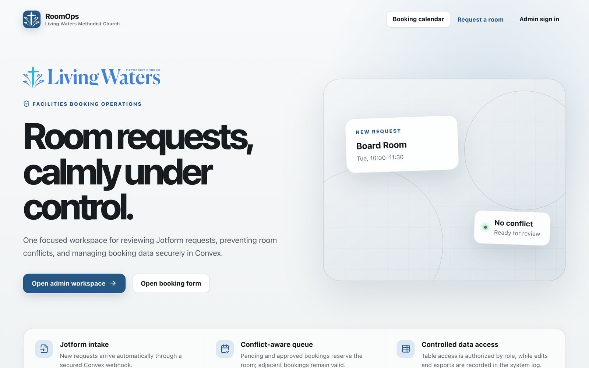

<!-- pagebreak -->

## Who this guide is for

Anyone can check the booking calendar and request a room. Only approved admins sign in to the dashboard, and what they can do depends on the role the Head Administrator gives them.

| Role | Who it's for | What they can do |
| --- | --- | --- |
| Requester | Anyone booking a room | Check the calendar, request a room, change or cancel their own booking from email |
| Booking Viewer | Staff who only need to look | See bookings, the booking data table and system logs; download exports |
| Booking Approver | Church Office staff who approve | Everything a Viewer can do, plus approve or reject requests and change requests |
| Data Editor | Staff who tidy up records | Everything a Viewer can do, plus edit or remove rows in the booking data table |
| Booking Manager | Senior Church Office staff | Approve, reject, edit and cancel bookings, and edit the booking data table |
| Head Administrator | One person in charge | Everything above, plus approving new admins, changing roles and managing settings |

Sections marked **Admins** are only relevant if you sign in to the dashboard.

## Checking if a room is free

The booking calendar shows every confirmed booking for our bookable rooms. You'll find it on the Room Booking page of the Leaders' Portal, or on its own at the booking website's **Booking calendar** link. No sign-in is needed.

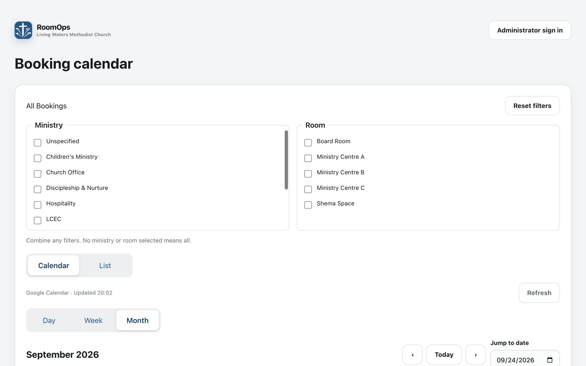

**Choosing what you see**

- **Calendar or List:** Calendar shows a grid. List shows the bookings day by day.
- **Day, Week, Month:** how much time the calendar shows at once.
- **‹ Today ›:** move back, jump to today, or move forward. **Jump to date** takes you to any date.
- **Ministry and Room filters:** tick one or more to see only those bookings. Ticking nothing shows everything. **Reset filters** clears them.

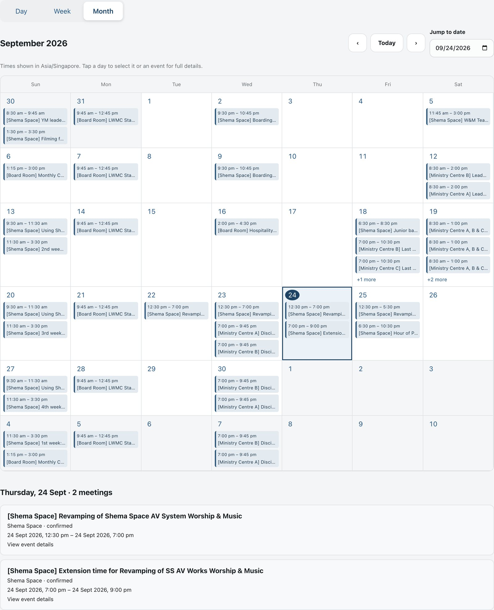

**Looking at a booking**

Tap or click a booking to see its full details: title, start and end times, room, ministry and status. Private events show only as **Busy**.

**On a phone**

- Swipe left or right on the calendar to move to the next or previous month, week or day.
- In Month view, tap a date to jump to that week.
- Booking details open in a panel from the bottom of the screen. Tap **Close** when you're done.

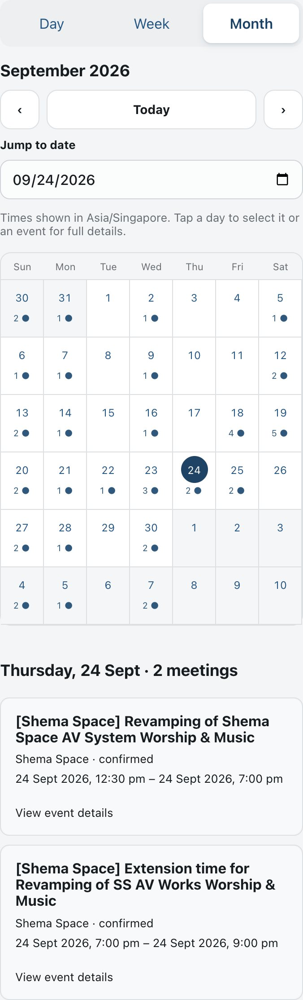 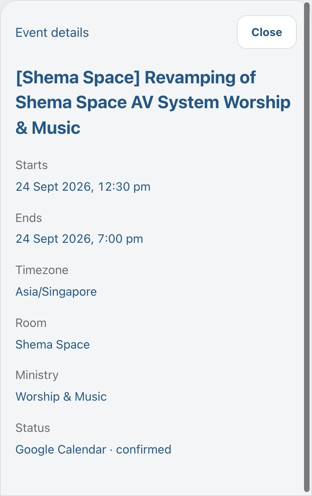

> **How up to date is it?** The calendar refreshes every 15 minutes. The time of the last update is shown above it, and **Refresh** checks again. Times are always shown in Singapore time.

<!-- pagebreak -->

## Booking a room

You request a room with the booking request form on the Room Booking page of the Leaders' Portal. Check the calendar first so you pick a free slot.

The form covers the church-managed venues: Living Waters Ministry Centre (rooms A, B and C, alone or combined), Shema Space, and the L1 Church Office facilities (Board Room, L1 Ministry Space, Counselling and Music Room). For other venues, contact the Church Office.

**Repeating bookings:** you can ask for a booking that repeats daily, weekly, every two weeks or monthly, with an optional last date.

**What happens after you submit**

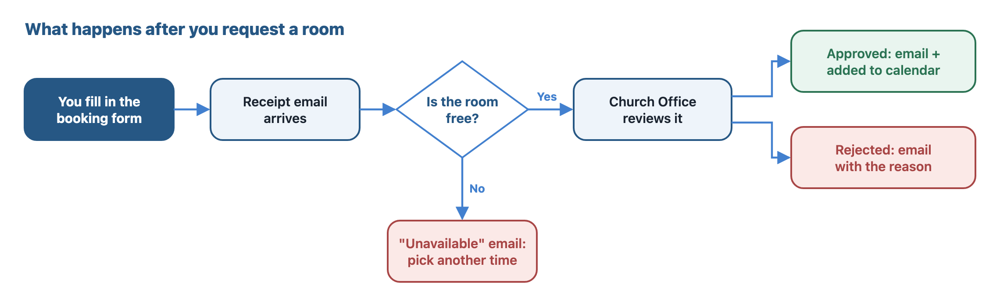

The system checks automatically whether the room is already taken. If it is, you'll hear straight away, so you can pick another time. Otherwise the Church Office reviews your request. Once it's approved, it appears on the booking calendar within about 15 minutes.

## Changing or cancelling your booking

Once your booking is approved, you can change or cancel it yourself. Use the **Request Changes** and **Cancel Booking** buttons in your approval email or in your 2-day reminder. No account or password is needed.

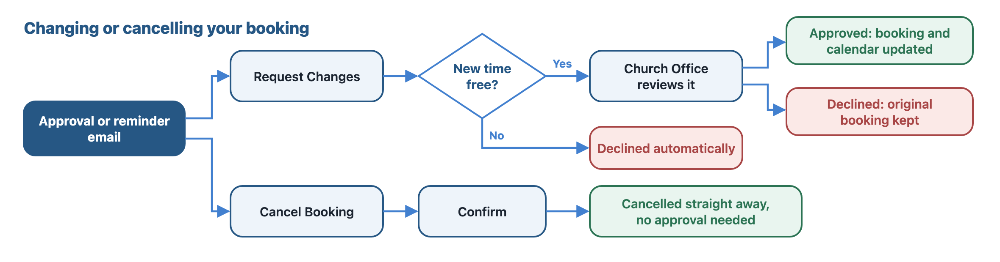

**To change a booking**

1. Tap **Request Changes**.
2. Pick the meeting you want to change.
3. For a repeating booking, choose **This event only** or **This event and following events**.
4. Change the room, date, start or end time, event name, ministry, or other answers from your form.
5. Check the highlighted differences, add a note if you like, and submit.
6. You get an email when the Church Office approves or declines the change. Until then, your original booking stays as it is.

**To cancel a booking**

1. Tap **Cancel Booking**.
2. Pick the meeting (or this and following meetings) and confirm.
3. It's cancelled straight away, with no approval needed, and removed from the calendar. You get a confirmation email.

**Good to know**

- Changes and cancellations close **2 hours before** the meeting starts. After that, contact the Church Office.
- Each booking can be changed up to **3 times**. Cancelling doesn't count towards this.
- A change is declined automatically if the new room or time is already taken.
- If your ministry isn't listed, choose **Others (Please Specify)** and type its name.
- Your name and email can't be changed this way. Ask the Church Office if they need correcting.
- Your link is private and works like a password, so please don't forward or delete the email.

<!-- pagebreak -->

## Emails you'll receive

All booking emails come from the church's booking email address. Each one ends with a list of your upcoming bookings and a link to the booking calendar.

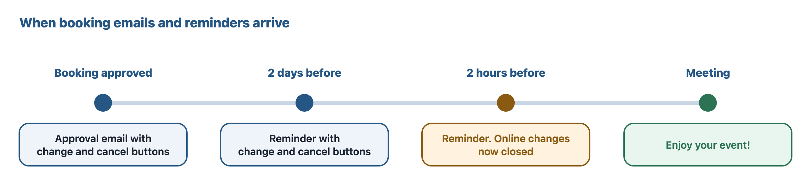

| Email | When it arrives |
| --- | --- |
| Booking received | Right after you submit the form |
| Booking unavailable | If the room or time you asked for is already taken |
| Booking approved | When the Church Office approves. Includes **Request Changes** and **Cancel Booking** |
| Booking rejected | When the Church Office declines, with their reason if given |
| Reminder, 2 days before | Before each approved meeting, with change and cancel buttons |
| Reminder, 2 hours before | Before each approved meeting. Changes are now closed |
| Change request received / approved / declined | When you ask for a change, and when it's decided |
| Cancellation confirmed | When your cancellation has gone through |
| Booking updated by the Church Office | If an admin edits or cancels your booking and chooses to notify you |

If you book less than 2 days ahead, you'll only get the 2-hour reminder. Cancelled meetings get no reminders. Emails can occasionally arrive a few minutes late.

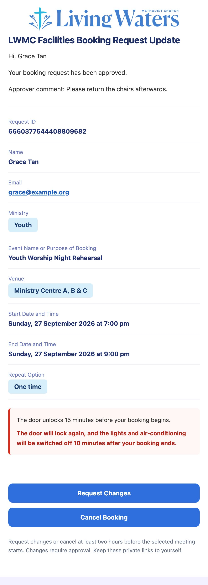

<!-- pagebreak -->

## Admins: getting access and signing in

New admins create an account, then ask the Head Administrator for a role. You can't use the dashboard until your request is approved.

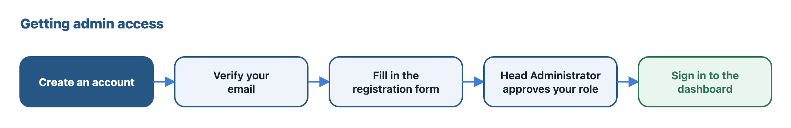

1. On the booking website, choose **Admin sign in**, then **Create an account**.
2. Sign up and verify your email address with the code you're sent.
3. Fill in the short registration form: your **display name**, the **role** you need, and **why you need access**.
4. Wait for the Head Administrator to approve you. Until then, signing in shows that your request is being reviewed.
5. Once approved, sign in any time from **Admin sign in**.

If your request is declined or your access is removed, signing in tells you so. Contact the Head Administrator if you think that's a mistake.

> **Tip:** open the dashboard in its own browser tab or window, not inside the Leaders' Portal. Signing in doesn't work inside the portal on iPhones.

## Admins: finding your way around

On a computer, the menu is down the left side. On a phone, use the bar along the bottom, and tap **More** for the full menu. You only see pages your role allows.

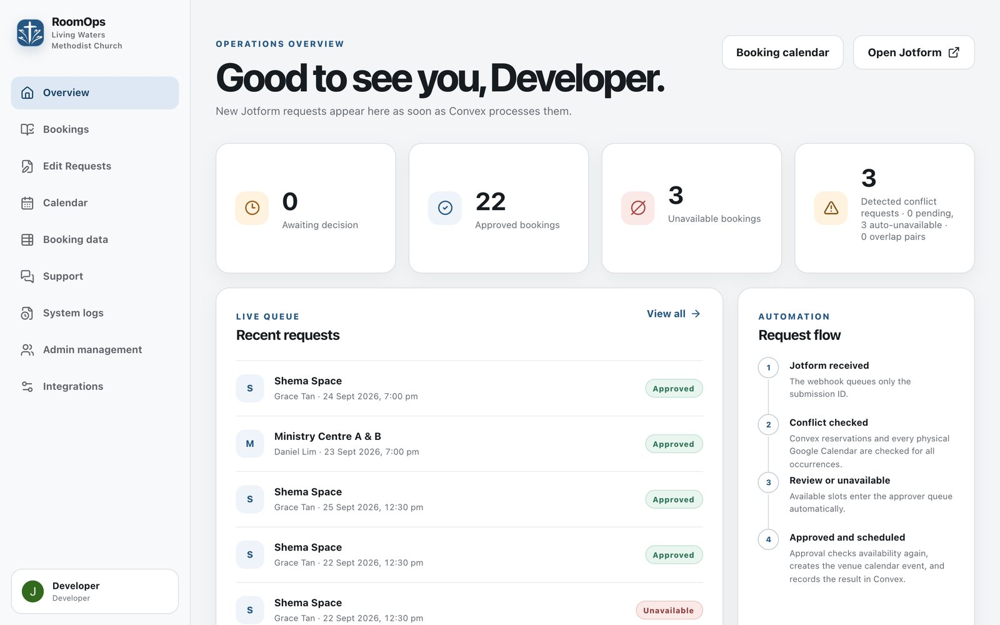

| Page | What it's for |
| --- | --- |
| Overview | Counts of requests awaiting a decision, approved and unavailable bookings, and conflicts; the latest requests |
| Bookings | Every request, with search and status filters. Approve, reject, edit or cancel from here |
| Edit Requests | Changes and cancellations sent in by requesters |
| Calendar | Each venue's Google Calendar, one venue at a time |
| Booking data | A spreadsheet-style table of all booking details, for editing and exporting |
| Support | Report a problem, follow replies, and read updates from the developer |
| System logs | A record of what happened in the system and who did it |
| Admin management | Head Administrator only: approve new admins and change roles |
| Integrations | Head Administrator only: email, calendar and form settings |

**On a phone:** swipe the menu to the left to close it. Forms such as Approve or Edit open as a panel from the bottom; tap ✕ or Cancel to close without saving.

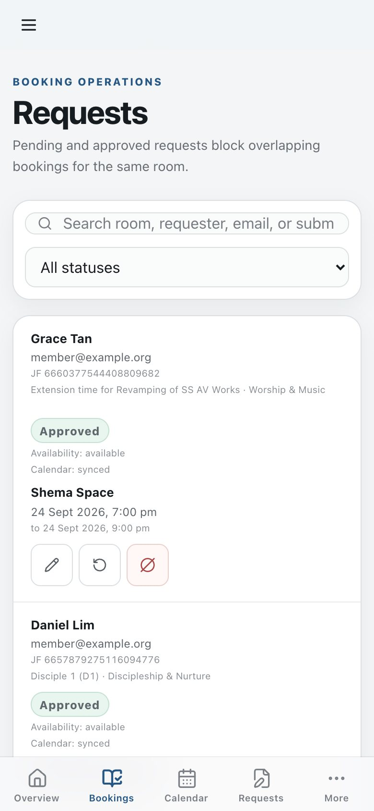 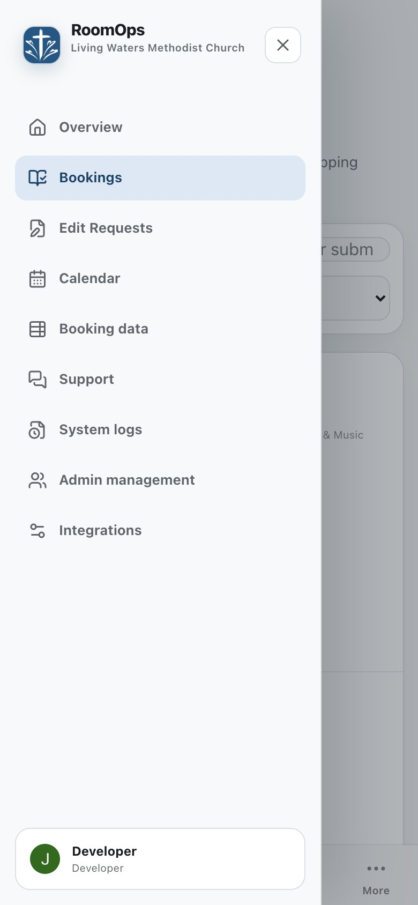

**Clash alerts:** if a new request clashes with another booking, an alert appears at the top of the screen. Tap **Review bookings** to look at it. It disappears after 10 seconds (it waits while you're touching it), and you can swipe it away on a phone.

<!-- pagebreak -->

## Admins: approving or rejecting requests

Booking Approvers, Booking Managers and the Head Administrator can decide on new requests, either in the dashboard or straight from an email.

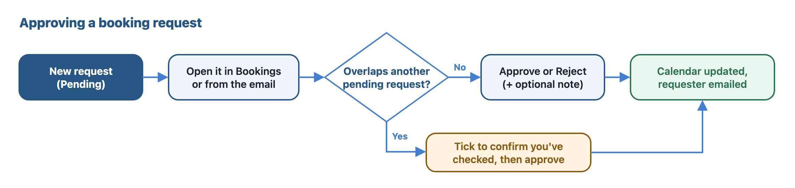

**In the dashboard**

1. Open **Bookings** and find the request (it's marked **Pending**).
2. Choose **Approve** or **Reject**, and add a note if you like. The note goes into the email to the requester.
3. If the request overlaps another pending request, you'll see a warning. Tick the box to confirm you've checked it, then approve again.
4. After you approve, the system checks the calendars once more and adds the booking to Google Calendar in the background. The booking's buttons are locked until that finishes.

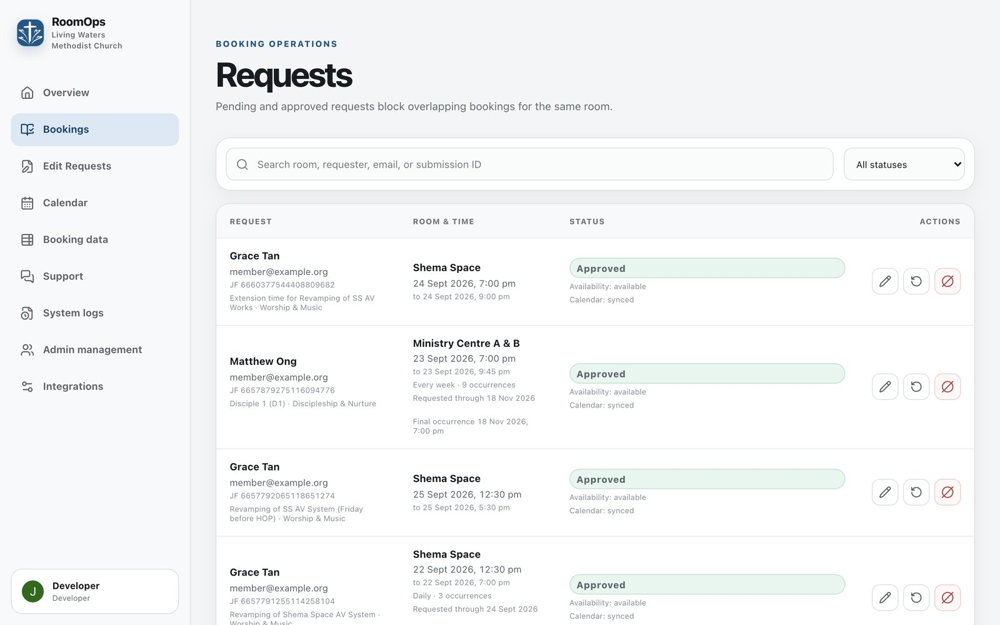

**From an email**

Everyone on the approver email list gets a "Needs Review" email for each new request. Tap **Review booking request**, check the details, choose **Approve** or **Reject**, and submit. You don't need to sign in, but each link works only once and expires, so don't forward it.

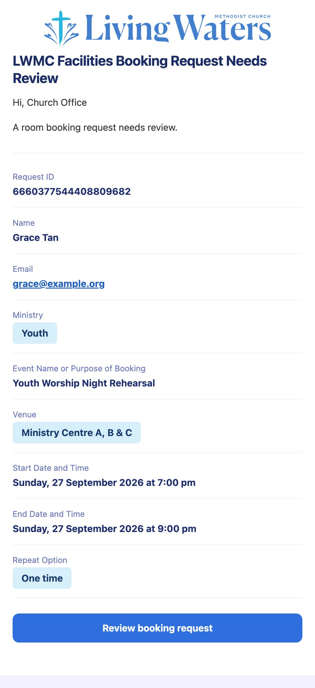

**Booking statuses**

| Status | Meaning |
| --- | --- |
| Pending | Waiting for a decision |
| Approved | Confirmed and on the calendar |
| Rejected | Declined by an admin |
| Unavailable | The room was already taken, so it was declined automatically |
| Cancelled | Cancelled by the requester or an admin; the record is kept for reference |

If a booking says its calendar update **needs attention**, open it and choose **Retry**.

## Admins: reviewing change requests

When a requester asks to change their booking, it appears on the **Edit Requests** page. Everyone on the approver email list also gets an email with a link to it.

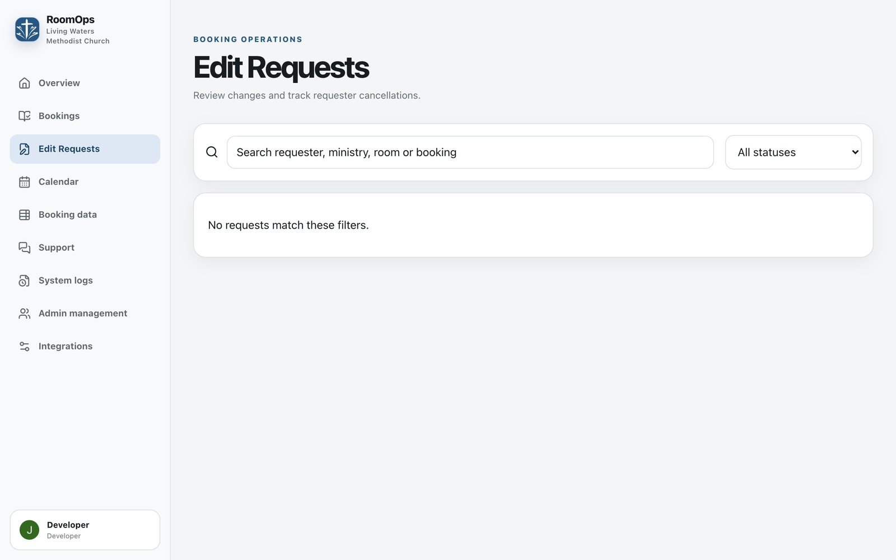

1. Open **Edit Requests**. Use the search box and status filter to find the request.
2. Open it to see the current booking next to the requested changes. Differences are highlighted.
3. Choose **Approve** or **Reject**, adding a reason if you like. The reason is included in the email to the requester.

Approving updates the booking and Google Calendar for you. There's nothing to edit by hand, and the old booking stays protected until the calendar update succeeds.

**Things that happen automatically**

- Changes that clash with another booking are declined without you needing to act.
- Cancellations don't need approval. They take effect immediately and the approver email list is notified.
- If a request has changed since you opened it, you'll be asked to close and reopen it before deciding.

If a request shows **Needs attention**, open it and choose **Retry synchronization**.

## Admins: editing, cancelling and exporting

**Editing a booking** (Booking Managers and the Head Administrator)

1. In **Bookings**, tap the pencil next to the booking.
2. Change the requester's details, room, times, event name, ministry, repeat pattern or other answers.
3. For a repeating booking, choose whether the change applies to one meeting or to that meeting and the ones after it.
4. Add an optional comment, and tick **Email the submitter** if the requester should be told. It's off by default.
5. Save. The Google Calendar events are replaced to match, and this can't be undone automatically.

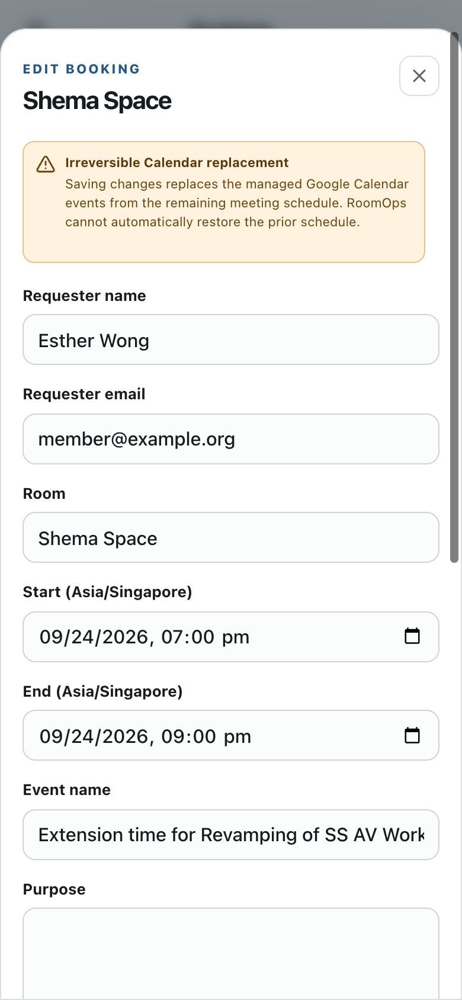

**Cancelling meetings**

1. In **Bookings**, tap the cancel button next to the booking.
2. Choose **This event**, **This and following events**, or **All events**.
3. Add an optional reason, and choose whether to email the requester.
4. Confirm. The meetings are removed from Google Calendar, and the booking record is kept for reference.

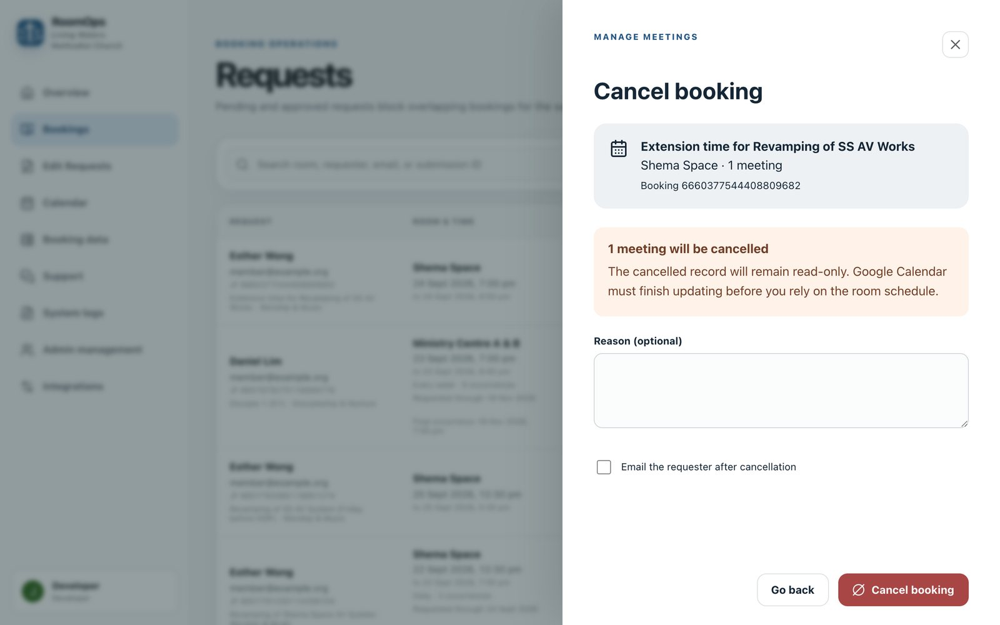

A cancelled booking can later be removed completely with **Erase data**, once its calendar cleanup has finished.

**The Booking data table**

**Booking data** shows every booking in a spreadsheet-style table, with a status filter.

- Staff with editing rights can switch on **Edit mode**, change cells, and choose **Save to Convex**. Tick **Email affected submitters after saving** if requesters should be told.
- **Download workbook (.xlsx)** saves the table as an Excel file. Save any unsaved edits first.

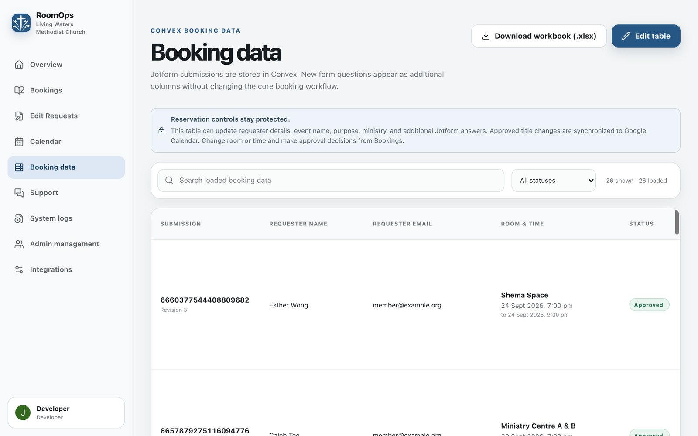

Every edit, cancellation and export is recorded in **System logs**.

<!-- pagebreak -->

## Admins: Support and System logs

**Reporting a problem**

Use **Support** when something isn't working.

1. Open **Support** and choose **Report a bug**.
2. Give it a title, pick how serious it is, and describe what happened.
3. Attach up to 5 screenshots if they help (PNG, JPEG, WebP or GIF, up to 5 MB each).
4. Send it. The developer is notified by email, and replies appear in the same conversation.

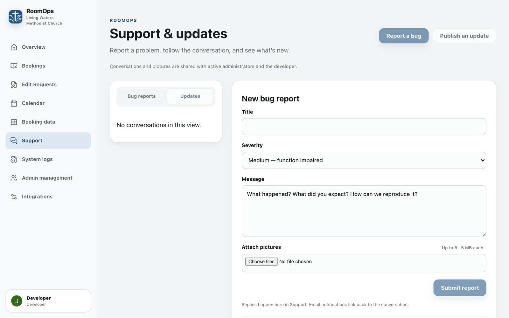

| Severity | Use it when |
| --- | --- |
| Low | A minor inconvenience |
| Medium | Something works, but not properly |
| High | You can't get your work done |
| Critical | The system is down for everyone |

Reports stay **Open** until they're marked **Solved**. All admins can read and reply to them.

**Updates from the developer**

The **Updates** tab lists announcements: new features, fixed bugs and known bugs. Anyone can read and reply; only the developer can post them.

**System logs**

**System logs** records what happened and who did it: new requests, approvals, edits, cancellations, exports, emails and errors. Filter by category or search by action, message or ID. Open **Technical details** on an entry to see more.

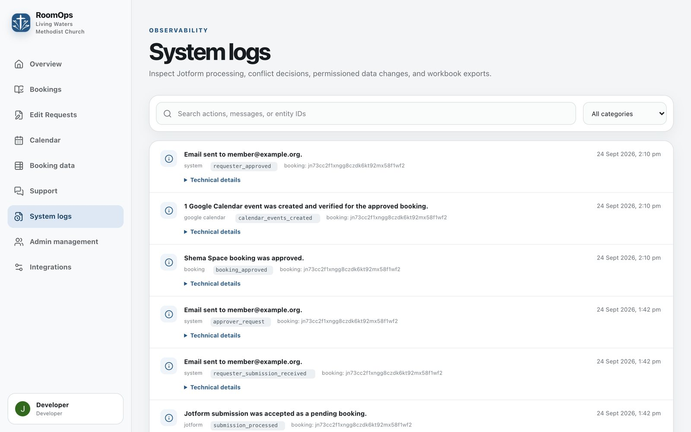

## Head Administrator: people and settings

Only the Head Administrator sees **Admin management** and **Integrations**.

**Approving and managing admins**

1. Open **Admin management**. New registrations show the person's name, email, the role they asked for and why.
2. **Approve** with the right role, or **Reject**. You can give a different role from the one requested.
3. Later, use **Change role** or **Remove** as responsibilities change.

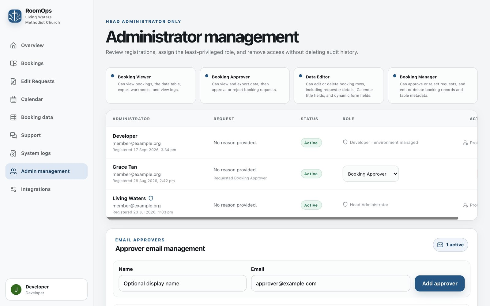

You can give four roles: Booking Viewer, Booking Approver, Data Editor and Booking Manager (see *Who this guide is for*). The Head Administrator role itself can't be changed from here.

**Who gets emails**

Also in **Admin management**:

- **Email approvers:** the addresses that receive "Needs Review" emails for new requests and change requests. Add, switch off, or remove addresses. Switching an address off also stops its unused approval links from working.
- **Conflict alerts:** the admins emailed when a booking clash is found.

Being on these lists doesn't give anyone dashboard access. Dashboard access comes only from an approved admin role.

**Integrations**

**Integrations** holds the connections to Jotform, Google Calendar and Gmail. It's looked after by the technical maintainer. The one tool you may need is **Send a test email**, to check that booking emails are going out.

## Quick answers

**Do I need an account to book, change or cancel?** No. Only admins sign in. Requesters use the form and the buttons in their emails.

**My booking was approved but isn't on the calendar yet.** The calendar refreshes every 15 minutes. Check again shortly, or tap **Refresh**.

**I can't find my approval email.** The 2-day reminder has the same buttons. Otherwise, contact the Church Office.

**It says changes are closed.** It's less than 2 hours before the meeting. Contact the Church Office directly.

**My change was declined straight away.** The room or time you picked is already booked. Check the calendar and try another slot.

**The booking calendar looks blank on my iPhone.** Close the page and open it again. If it's still blank, use the "simplified online calendar" link on the Room Booking page.

**I'm an admin and signing in doesn't work on my phone.** Open the booking website in Safari or Chrome directly, not inside the Leaders' Portal.

**Something isn't working.** Admins: send a bug report from **Support**. Everyone else: contact the Church Office.

## What's new

Changes to Room Booking, newest first. Features marked **Coming soon** are finished but not yet switched on for everyone.

| Date | Change | Status |
| --- | --- | --- |
| 24 Sep 2026 | New church look and logo; dashboard works like an app on phones; calendar swipes between dates and now loads on iPhone in the Leaders' Portal; clearer emails on phones; Ministry Centre room names standardised; calendar entries no longer repeat a separate Purpose line | Coming soon |
| 23 Sep 2026 | Public calendar refreshes every 15 minutes | Coming soon |
| 20 Sep 2026 | Reminder emails 2 days and 2 hours before each meeting | Coming soon |
| 19 Sep 2026 | Requesters can change or cancel bookings from their email; new Edit Requests page for admins; "Others (Please Specify)" ministry field | Coming soon |

**Keeping this guide up to date**

Whenever a new feature is released, the maintainer updates the sections it affects, refreshes the screenshots and adds a row to the top of this table. Screenshots use made-up names and email addresses; they never show real church members.
